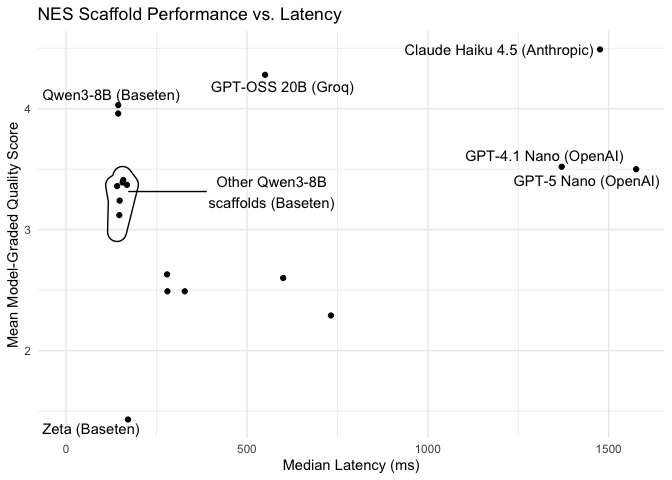

<!-- README.md is generated from README.Rmd. Please edit that file -->

# nesevals

<!-- badges: start -->

<!-- badges: end -->

nesevals provides tooling for evaluating next edit suggestion (NES)
scaffolds across different edit history formats, output formats, and
models.

## Installation

Install the package with:

``` r
# if needed:
# install.packages("pak")

pak::pak("posit-dev/nesevals")
```

## Example

The package ships with a data frame `nes_results` that summarizes
experimental results:

``` r
library(dplyr)
library(nesevals)

glimpse(nes_results)
#> Rows: 18
#> Columns: 11
#> $ model              <chr> "claude-haiku-4-5-20251001", "openai/gpt-oss-20b", …
#> $ prompt             <chr> "rewrite-region", "rewrite-region", "rewrite-region…
#> $ edit_history       <chr> "narrative", "narrative", "narrative", "narrative",…
#> $ output_format      <chr> "rewrite_region", "rewrite_region", "rewrite_region…
#> $ n_completions      <int> 80, 80, 240, 240, 80, 80, 240, 240, 240, 240, 240, …
#> $ n_processable      <int> 80, 80, 240, 240, 80, 80, 240, 240, 240, 240, 240, …
#> $ n_exact            <int> 54, 46, 123, 123, 32, 30, 120, 114, 111, 93, 102, 9…
#> $ mean_score         <dbl> 4.49, 4.28, 4.03, 3.96, 3.52, 3.50, 3.41, 3.39, 3.3…
#> $ median_latency_ms  <dbl> 1476, 550, 144, 144, 1370, 1576, 158, 156, 168, 141…
#> $ mean_input_tokens  <dbl> 1358, 1050, 1181, 1155, 1128, 1127, 921, 905, 1097,…
#> $ mean_output_tokens <dbl> 140, 169, 108, 107, 95, 119, 219, 219, 225, 130, 12…
```

    #> Warning: package 'ggplot2' was built under R version 4.5.2


